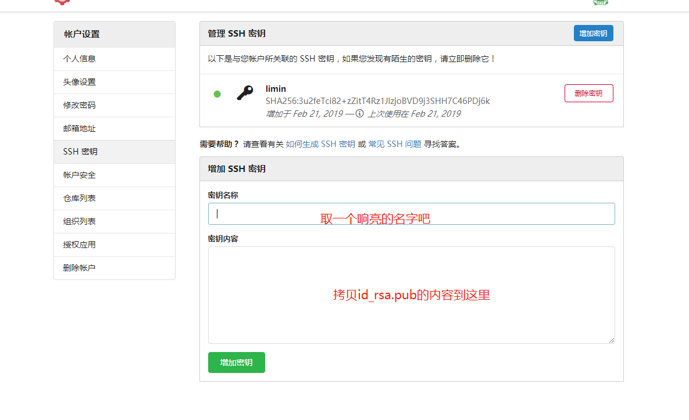

## 生成ssh 秘钥
> 通过git bash 执行以下命令，之后一直回车
```
ssh-keygen -t rsa -C "email"
```
> 生成的秘钥在 **C:/用户/xxx/.ssh** 文件下面
拷贝**id_rsa.pub**文件的内容，到Gogs的用户设置 生成SSH秘钥



> 在**C:/用户/xxx/.ssh** 新建config文件（无任何尾缀）并把如下内容拷贝到config文件中
```
Host github.e-masspick.com
    HostName github.e-masspick.com
	Port 10022
	IdentityFile ~/.ssh/id_rsa
	IdentitiesOnly yes
```

## clone仓库之后，推送到远程仓库
```
touch README.md
git init
git add README.md
git commit -m "first commit"
git remote add origin git@github.e-masspick.com:limin/git-helper.git
git push -u origin master
```

## 分支管理
拉分支：
> 创建分支版本
```
git branch ${version}
```

> 切换分支，并提交分支请求
```
git checkout ${version}
git push --set-upstream origin ${version}
```

> 其他相关分支开发人员，clone对应的分支版本
```
git clone -b ${version} git@github.e-masspick.com:xxx/xxxx.git
```

## idea用SSH+秘钥模式提交
