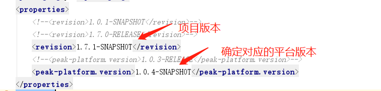
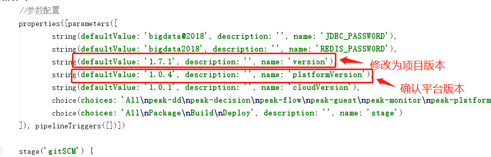

### 标签
> 线上完成部署后，需要提交合并master申请。申请通过后，拉取最新的master代码，并打标签以及推送到远程仓库
```
git checkout master
git pull origin master
git tag 1.6.0
git push origin 1.6.0
```

### 分支
> 项目立项完成，确定项目版本后。通过master创建对应的dev分支版本
```
git checkout master
git pull origin master
git branch dev-1.7.0
git push origin dev-1.7.0
```
> 推送分支之前注意事项
1. 修改maven对应的版本

2. 修改Jenkins对应的版本



> 拉取指定分支
```
git checkout -b dev-1.7.0 origin/dev-1.7.0
```

> 克隆指定分支
```
git clone --branch dev-1.0.3 git@github.e-masspick.com:Peak/peak-platform.git
```


> 推送到指定分支
```
git push origin dev-1.7.0
```